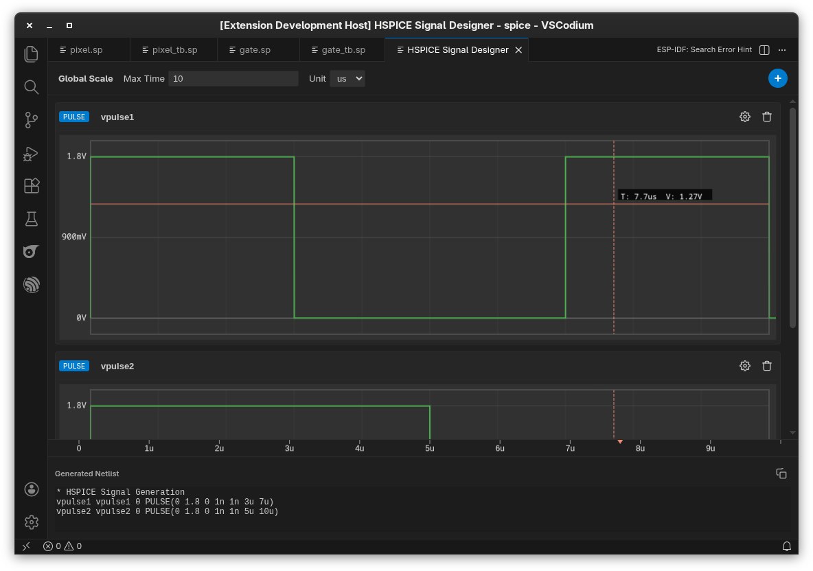

# HSPICE Language Support for VS Code

This extension provides robust syntax highlighting, code snippets, and visual tools for **HSPICE** netlists (`.sp`, `.lis`, `.hsp`). It is designed to make circuit simulation workflows faster and less error-prone.

## Features

* **Visual Signal Generator (New!):**
    * Interactively design **PULSE** and **SIN** voltage sources.
    * **Real-time Visualization:** See waveforms update instantly as you adjust parameters.
    * **Global Time Scaling:** Check signal alignment across multiple sources with a synchronized ruler.
    * **Smart Formatting:** Automatic unit conversion (e.g., `100n`, `5u`).
* **Visual PWL Designer:**
    * Graphically draw Piece-Wise Linear (PWL) sources.
    * Waveform generator for Square, Triangle, and Sawtooth waves.
* **Syntax Highlighting:**
    * Case-insensitive support (e.g., `.TRAN` and `.tran` are both recognized).
    * Differentiates between **Simulations** (`.tran`, `.ac`), **Definitions** (`.subckt`, `.param`), and **Options** (`.option`).
    * Highlights engineering units (`u`, `n`, `meg`, `k`).
    * Supports full-line comments (`*`) and inline comments (`$`).
* **Intelligent Snippets:**
    * Auto-completion for complex sources (`PULSE`, `SIN`, `PWL`).
    * Templates for analyses (`.tran`, `.dc`, `.ac`) with tab-stops.
    * Automatic header generation with timestamps.

---

## Visual Signal Generator

Design complex independent sources without memorizing the parameter order.

### Capabilities
* **Multi-Signal Plotting:** Add as many sources as you need to visualize timing relationships.
* **Synchronized Ruler:** A global crosshair allows you to verify timing across all cards simultaneously.
* **Interactive Editing:** Click the **Gear** icon to fine-tune parameters (V1, V2, TD, TR, TF, PW, PER, etc.) with helpful tooltips.
* **One-Click Export:** Instantly generate and copy the valid HSPICE netlist code.

### How to Use
1. Open the Command Palette (`Ctrl+Shift+P` or `Cmd+Shift+P`).
2. Run **`HSPICE: Open Visual Signal Generator`**.

---

## Visual PWL Designer

Stop manually typing coordinate pairs! This tool allows you to draw PWL sources point-by-point.

### How to Use
1. Open the Command Palette (`Ctrl+Shift+P` or `Cmd+Shift+P`).
2. Run **`HSPICE: Open Visual PWL Designer`**.

---

## Snippets Reference

### Source Definitions

| Trigger | Name | Description |
| :--- | :--- | :--- |
| `pulse` | **Pulse Source** | Generates `PULSE(V1 V2 TD TR TF PW PER)` template. |
| `sin` | **Sinusoidal** | Generates `SIN(VO VA FREQ TD THETA)` template. |
| `pwl` | **PWL Source** | Template for Piece-Wise Linear source. |
| `exp` | **Exponential** | Generates `EXP` source template. |

### Analysis Commands

| Trigger | Name | Description |
| :--- | :--- | :--- |
| `.tran` | **Transient** | Sets step, stop, and start times. |
| `.dc` | **DC Sweep** | Sweeps a source from start to stop values. |
| `.ac` | **AC Analysis** | Selects DEC/OCT/LIN via dropdown menu. |
| `.meas` | **Measure** | Template for `.meas TRAN/AC/DC ...` |
| `.meas delay`| **Prop. Delay** | Template for `TRIG` and `TARG` delay measurement. |

### Circuit Definitions

| Trigger | Name | Description |
| :--- | :--- | :--- |
| `.subckt` | **Subcircuit** | Creates a `.SUBCKT` block with `.ENDS`. |
| `.param` | **Parameter** | Defines a variable (e.g., `vdd=3.3`). |
| `.option` | **Options** | Adds `.option post=1` or other settings. |
| `.inc` | **Include** | Includes an external netlist file. |
| `.lib` | **Library** | Loads a model library file. |

---

## Syntax Highlighting Rules

This extension follows standard HSPICE formatting rules:

| Element | Rule | Example |
| :--- | :--- | :--- |
| **Comments** | Starts with `*` (full line) or `$` (inline). | `* This is a comment`   `R1 1 0 1k $ Resistor` |
| **Line Break** | Starts with `+` at the beginning of a line. | `.tran 1n 100n`   `+ start=0` |
| **Units** | Case-insensitive engineering notation. | `10u`, `10U`, `1MEG`, `1k` |

---

## Author

**Muhammad Shofuwan Anwar**
* Email: muh.shofuwan.a@mail.ugm.ac.id
* LinkedIn: [linkedin.com/in/mshofuwan-anwar/](https://www.linkedin.com/in/mshofuwan-anwar/)