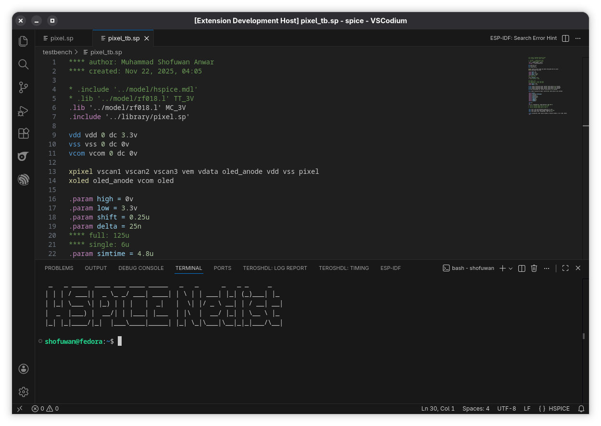
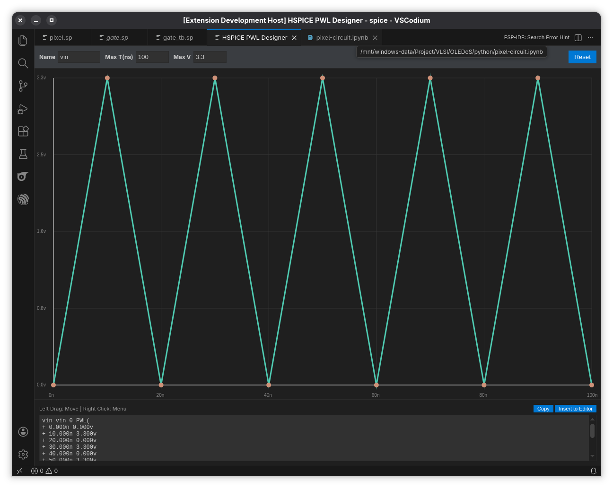

# HSPICE Language Support for VS Code

This extension provides robust syntax highlighting, code snippets, and a **Visual PWL Designer** for **HSPICE** netlists (`.sp`, `.lis`, `.hsp`). It is designed to make circuit simulation workflows faster and less error-prone.

## Features

* **Visual PWL Designer (New!):**
    * Graphically draw Piece-Wise Linear (PWL) sources.
    * **Waveform Generator:** Automatically create Square, Triangle, and Sawtooth waves.
    * Export generated code directly to your netlist.
* **Syntax Highlighting:**
    * Case-insensitive support (e.g., `.TRAN` and `.tran` are both recognized).
    * Differentiates between **Simulations** (`.tran`, `.ac`), **Definitions** (`.subckt`, `.param`), and **Options** (`.option`).
    * Highlights engineering units (`u`, `n`, `meg`, `k`).
    * Supports full-line comments (`*`) and inline comments (`$`).
* **Intelligent Snippets:**
    * Auto-completion for complex sources (`PULSE`, `SIN`, `PWL`).
    * Templates for analyses (`.tran`, `.dc`, `.ac`) with tab-stops.
    * Automatic header generation with timestamps.

---

## Visual PWL Designer

Stop manually typing coordinate pairs! This extension includes a GUI to visualize and generate PWL sources.

### How to Use
1. Open the Command Palette (`Ctrl+Shift+P` or `Cmd+Shift+P`).
2. Run **`HSPICE: Open Visual PWL Designer`**.
3. **Draw:** Click on the canvas to add points. Drag points to adjust timing/voltage.
4. **Edit:** Right-click a point to **Delete** it or **Snap** its voltage to the nearest neighbor.
5. **Generate:** Right-click the background and select `Generate >` to create standard waveforms:
    * **Square:** Set V_High, V_Low, Frequency, Duty Cycle, **Rise Time**, and **Fall Time**.
    * **Triangle / Sawtooth:** Customizable frequency and voltage limits.
6. **Export:** Click **"Insert to Editor"** to paste the generated SPICE code directly into your file.

---

## HSPICE Cheat Sheet (Snippets)

Type the **Trigger** command and press `Tab` or `Enter` to expand it.

### Documentation & Headers
| Trigger | Name | Expands To |
| :--- | :--- | :--- |
| `header` | **Full Header** | Creates a file header block with Author, Date, and Description. |
| `author` | **Author Signature** | Inserts `**** author: Name`. |
| `datetime`| **Timestamp** | Inserts `**** created: [Current Date & Time]`. |

### Sources & Stimuli

| Trigger | Name | Expands To (Example) |
| :--- | :--- | :--- |
| `pulse` | **Pulse Source** | `PULSE(v1 v2 td tr tf pw per)` |
| `sin` | **Sinusoidal** | `SIN(vo va freq td theta phase)` |
| `pwl` | **Piece-Wise Linear** | `PWL(t1 v1 t2 v2 t3 v3)` |
| `ic` | **Initial Condition** | `.IC V(node)=voltage` |

### Analysis Commands

| Trigger | Name | Description |
| :--- | :--- | :--- |
| `.tran` | **Transient** | Sets step, stop, and start times. |
| `.dc` | **DC Sweep** | Sweeps a source from start to stop values. |
| `.ac` | **AC Analysis** | Selects DEC/OCT/LIN via dropdown menu. |
| `.meas` | **Measure** | Template for `.meas TRAN/AC/DC ...` |
| `.meas delay`| **Prop. Delay** | Template for `TRIG` and `TARG` delay measurement. |

### Circuit Definitions

| Trigger | Name | Description |
| :--- | :--- | :--- |
| `.subckt` | **Subcircuit** | Creates a `.SUBCKT` block with `.ENDS`. |
| `.param` | **Parameter** | Defines a variable (e.g., `vdd=3.3`). |
| `.option` | **Options** | Adds `.option post=1` or other settings. |
| `.inc` | **Include** | Includes an external netlist file. |
| `.lib` | **Library** | Loads a model library file. |

---

## Syntax Highlighting Rules

This extension follows standard HSPICE formatting rules:

| Element | Rule | Example |
| :--- | :--- | :--- |
| **Comments** | Starts with `*` (full line) or `$` (inline). | `* This is a comment`   `R1 1 0 1k $ Resistor` |
| **Line Break** | Starts with `+` at the beginning of a line. | `.tran 1n 100n` `+ start=0` |
| **Numbers** | Supports engineering suffixes. | `10k`, `0.1u`, `10meg`, `1.5T` |
| **Options** | Highlights keys and values differently. | `.option runlvl=6 method=gear` |

---

## Author

**Muhammad Shofuwan Anwar**
Email: [muh.shofuwan.a@mail.ugm.ac.id](mailto:muh.shofuwan.a@mail.ugm.ac.id)